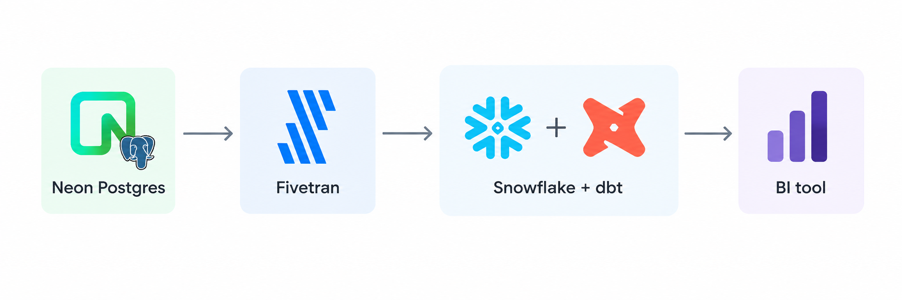
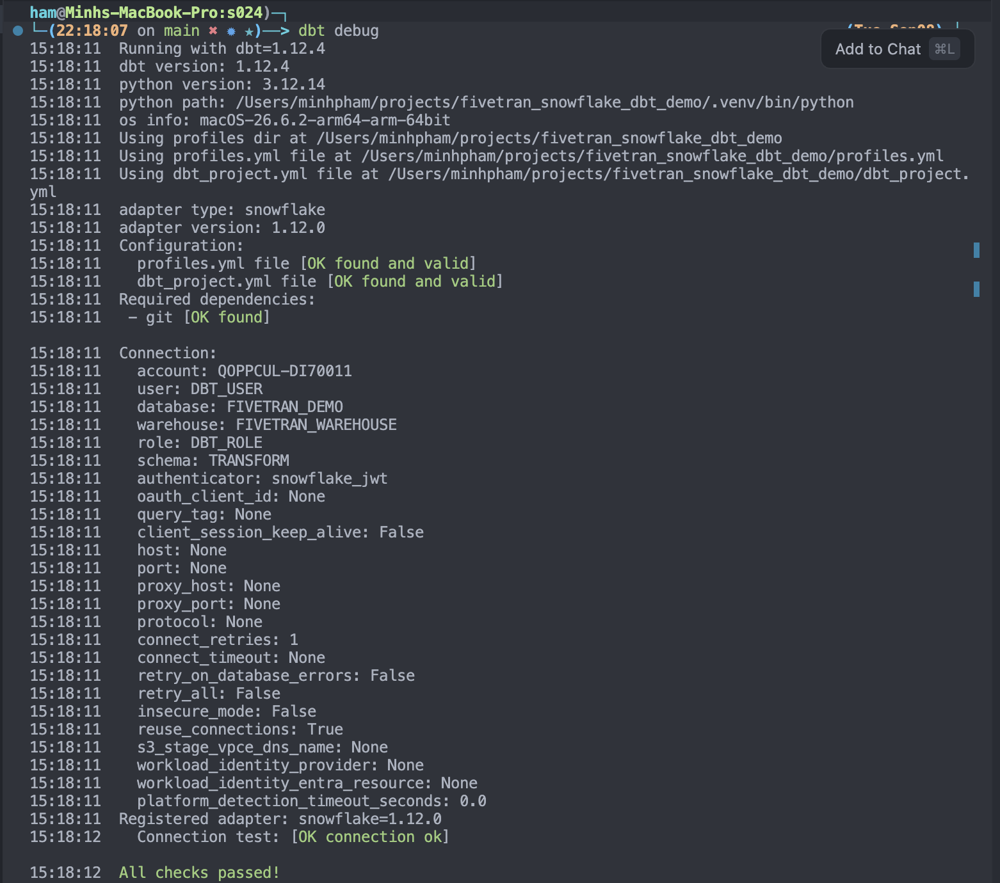
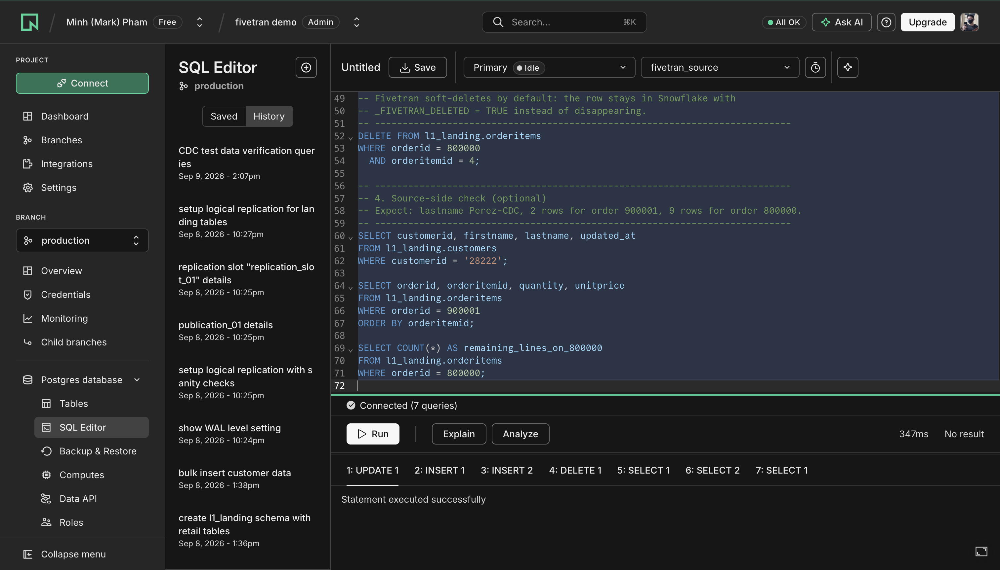
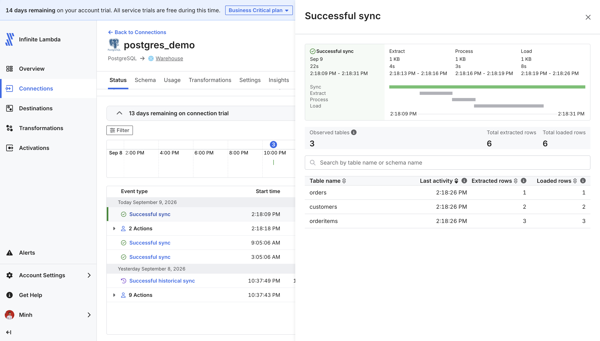
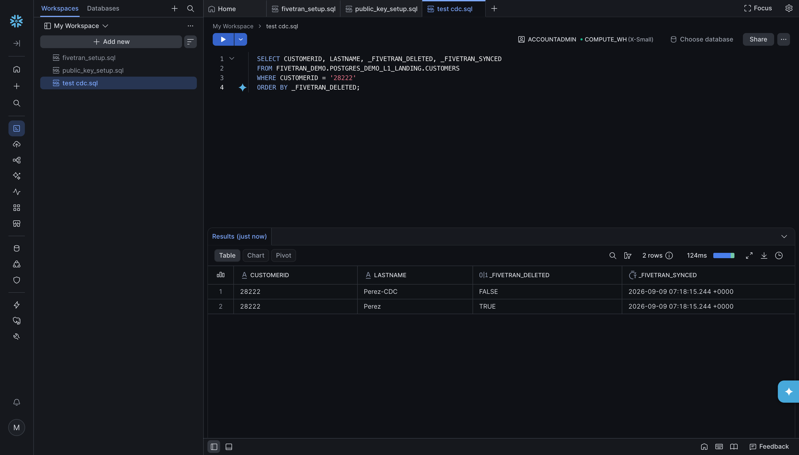

# Fivetran Snowflake dbt Demo

This is a small end-to-end ELT tutorial. You will copy retail sample data from a hosted Postgres database into Snowflake, then clean it with dbt.



**ELT** means Extract, Load, Transform: copy the data first, then reshape it in the warehouse. You do not need to know SQL well to follow the setup. You do need to be comfortable opening a browser, pasting SQL into a console, and running a few commands in a terminal.

Neon is only the **source** (the operational database). Snowflake is the **warehouse** (where analytics happens). Fivetran is the managed copy, and it also orchestrates dbt. dbt never talks to Neon; it only reads the Snowflake replica. The BI tool on the right is where this would go next — the tutorial stops once the reporting tables exist.

The work is two parts, then a check that the pipeline is live. Finish Part 1 before you start Part 2.

| Part | What you do | When you are done |
|---|---|---|
| **1. Ingestion** | Put sample orders into Neon, create a Snowflake trial, and let Fivetran copy the tables | Snowflake has 100 customers in the `FIVETRAN_DEMO` landing schema |
| **2. Transformation** | Connect this Git repo to Fivetran Transformations so Fivetran runs the dbt project on a schedule | A dbt job succeeds in Fivetran and `FIVETRAN_DEMO.SERVE` has reporting tables |
| **3. CDC test** | Change a few rows in Neon and watch them travel to the reporting tables on their own | An edit in Postgres shows up in `FIVETRAN_DEMO.SERVE` without you running anything |

**Fivetran orchestrates dbt.** The point of Part 2 is not to run `dbt run` by hand forever. You give Fivetran a read-only deploy key to this repository, and Fivetran clones it, generates its own `profiles.yml` from the Snowflake destination, and runs the jobs defined in [`deployment.yml`](deployment.yml) — one triggered by the Postgres sync, one on a cron. Installing the dbt CLI locally is optional and only for developing models before you push them.

Detailed click-paths and screenshots live in the linked guides. This file is the path through the tutorial.

## Accounts you need

All of this runs on free tiers. Create the accounts when the steps ask for them. You do not need dbt Cloud.

| Tool | Role in this tutorial | Sign up |
|---|---|---|
| [Neon](https://console.neon.tech/signup) | Free serverless Postgres. Holds the sample store data. | Free account |
| [Snowflake](https://signup.snowflake.com/) | Free 30-day trial warehouse. Destination for Fivetran and dbt. | Walkthrough in [snowflake/README.md](snowflake/README.md) |
| [Fivetran](https://fivetran.com/signup) | Free account. Copies Neon into Snowflake, then runs this dbt project. | Free account |
| GitHub | Hosts this repo. Fivetran clones it over SSH, so you need to add a deploy key. | Fork or push your own copy |
| dbt Core | Free CLI. **Optional**, for local development only. Fivetran installs its own dbt for scheduled runs. | Python 3.10–3.13 (3.12 is the default in [`.python-version`](.python-version)) |

---

# Part 1 — Ingestion: copy Neon into Snowflake

Goal: an exact replica of eight Order Management System (OMS) tables sitting in Snowflake. No cleaning yet.

The sample is SleekMart OMS data (customers, orders, products, and so on). Fivetran will keep copying **changes** after the first load, using Postgres logical replication (a change log, not a full table scan every time).

## 1.1 Load the sample database in Neon

Neon is hosted Postgres. You create a project in the browser, then run SQL in Neon’s SQL Editor.

**Follow [source/README.md](source/README.md).** In short:

1. Sign up and create a project (this demo uses branch `production`).
2. Create a database named `fivetran_source` (do not use the default `neondb` for the rest of the steps).
3. In the SQL Editor, switch the dropdown to `fivetran_source`.
4. Run [`source/sql/schema.sql`](source/sql/schema.sql), then [`source/sql/insert.sql`](source/sql/insert.sql).
5. Run `SELECT * FROM l1_landing.customers;` and confirm **100 rows**.

`l1_landing` is the schema (a folder of tables) Fivetran will read:

| Table | What it is | Rows |
|---|---|---|
| `customers` | Customer profiles | 100 |
| `dates` | Calendar dimension | 365 |
| `employees` | Store staff and managers | 101 |
| `products` | Catalog and supplier cost | 200 |
| `suppliers` | Vendor contacts | 20 |
| `stores` | Store locations | 10 |
| `orders` | Order headers | 300 |
| `orderitems` | Line items | 1,651 |

If the query returns nothing, the usual miss is running SQL against `neondb` instead of `fivetran_source`.

## 1.2 Turn on logical replication

Fivetran can re-read whole tables on a schedule. This demo uses **logical replication**: Postgres writes row changes to its write-ahead log (WAL), and Fivetran reads only those changes.

That needs three things, all described in [source/README.md](source/README.md#enable-logical-replication-for-fivetran):

1. In Neon: **Settings → Logical Replication → Enable**. Confirm with `SHOW wal_level;` → `logical`. This cannot be turned off later and restarts compute briefly.
2. Still on `fivetran_source`, run [`source/sql/replication.sql`](source/sql/replication.sql). It creates publication `publication_01` (which tables to stream) and slot `replication_slot_01` (Fivetran’s bookmark in the WAL).
3. Keep those two names. You will type them into Fivetran later.

If you want the “why” behind WAL, publications, and slots, read [source/postgres_cdc.md](source/postgres_cdc.md) after this part. You do not need it to finish the setup.

## 1.3 Create a Snowflake trial and Fivetran objects

Snowflake is empty until you create a place for Fivetran to write. Do **not** point Fivetran at the trial default warehouse `COMPUTE_WH`.

**Follow [snowflake/README.md](snowflake/README.md).** In short:

1. Start an **AI Data Cloud** trial at [signup.snowflake.com](https://signup.snowflake.com) (not the Cortex Code CLI trial).
2. In Snowsight, run [`snowflake/sql/fivetran_setup.sql`](snowflake/sql/fivetran_setup.sql). That creates `FIVETRAN_ROLE`, `FIVETRAN_USER`, `FIVETRAN_WAREHOUSE`, and database `FIVETRAN_DEMO`.
3. On your laptop, generate a key pair (`fivetran_rsa_key.p8` / `.pub`). Snowflake does not download a private key for you. This pair is **only** for Fivetran.
4. Paste the **public** key body into [`snowflake/sql/fivetran_keypair.sql`](snowflake/sql/fivetran_keypair.sql) and run it.
5. Run [`snowflake/sql/verify.sql`](snowflake/sql/verify.sql) and copy the host: `<org>-<account>.snowflakecomputing.com` (hyphen, not a dot).

`FIVETRAN_USER` is a service user: no password, key-pair only. Keep `~/.snowflake/fivetran_rsa_key.p8` on this machine. You will paste that **private** key into Fivetran next.

## 1.4 Connect Fivetran (source, then destination)

**Follow [fivetran/README.md](fivetran/README.md).** Create the PostgreSQL source first, then the Snowflake destination. Attach the destination before the first sync.

**PostgreSQL source** (Neon → Fivetran):

- Connection method: **Connect directly**.
- Host from Neon **Connect**, pooling **off** (hostname must not contain `-pooler`). Port `5432`. SSL required.
- Database `fivetran_source` (the form starts **empty**; do not leave it blank). User `neondb_owner` and the Neon password.
- Incremental sync: logical replication / `pgoutput`, slot `replication_slot_01`, publication `publication_01`.
- Save & Test. Logical replication should pass. Neon Free often warns about `wal_sender_timeout` and `wal_buffers`. You cannot change those on Neon. **Continue** is fine.

Split the Neon URI into fields. Do not paste the whole `postgresql://…` string into one box. How to split it is in [source/README.md](source/README.md#connection-string-for-fivetran) and [fivetran/README.md](fivetran/README.md#1-postgres-source-neon--fivetran).

**Snowflake destination** (Fivetran → Snowflake):

- Host from `verify.sql`, port `443`, user `FIVETRAN_USER`, database `FIVETRAN_DEMO`, role `FIVETRAN_ROLE`, warehouse `FIVETRAN_WAREHOUSE`.
- Auth: key pair. Paste the full private key (`BEGIN` / `END` included). Leave “encrypted” off.
- Save & Test until host, warehouse, database, stage, and permissions pass.

## 1.5 First sync — Part 1 checkpoint

In Fivetran, the connection stays **Paused** until you pick tables.

1. **Review connection schema** and select `l1_landing` (the eight OMS tables).
2. Start the sync.
3. Expect about half a minute and **2,747 rows** extracted and loaded.

In Snowflake (Snowsight), run:

```sql
SHOW SCHEMAS IN DATABASE FIVETRAN_DEMO;
SELECT COUNT(*) FROM FIVETRAN_DEMO.POSTGRES_DEMO_L1_LANDING.CUSTOMERS;
```

You want **100**. Write down the landing schema name exactly as `SHOW SCHEMAS` reports it. By default Fivetran prefixes it with the connection name, so a connection called `postgres_demo` produces `POSTGRES_DEMO_L1_LANDING` rather than `L1_LANDING`, and Part 2 has to be told which one you got.

Also note the connection's **ID** while you are here: the two-word system name Fivetran gave it, visible in the connection's Setup tab and in the browser URL. Part 2 needs it to schedule dbt off this connection.

Part 1 is done. The warehouse now has a landing replica. Next you transform it.

---

# Part 2 — dbt transformations, run by Fivetran

Goal: Fivetran clones this repository, runs the dbt project against the landing schema, and writes cleaned tables into `TRANSFORM` and `SERVE` on a schedule.

**dbt** (data build tool) turns SQL files into tables: it works out the dependency order, runs the models in Snowflake, and tests the results. It does not extract data, so if Part 1 is incomplete every model fails on a missing landing table.

**Fivetran Transformations for dbt Core** is what actually runs it. Fivetran holds a read-only deploy key to your GitHub repo, prepares a dbt environment with a `profiles.yml` built from your Snowflake destination, and executes the jobs described in [`deployment.yml`](deployment.yml). There is no dbt Cloud account and no server of your own.

Models come from [sleekdata/oms_fivetran_transforms](https://github.com/sleekdata/oms_fivetran_transforms). The dbt project lives at the **repo root** (`dbt_project.yml`, `models/`), which is where Fivetran looks by default.

```
FIVETRAN_DEMO.POSTGRES_DEMO_L1_LANDING   Fivetran-synced OMS tables (Part 1)
        |
        v
FIVETRAN_DEMO.TRANSFORM      staging + orders_fact
        |
        v
FIVETRAN_DEMO.SERVE          customerrevenue, emp_weekly_sales
```

| Model | Schema | What it builds |
|---|---|---|
| `customers_stg` | TRANSFORM | Customers plus `CustomerName` |
| `orders_stg` | TRANSFORM | Orders with status labels and channel |
| `orderitems_stg` | TRANSFORM | Lines plus `TotalPrice` |
| `employees_stg` | TRANSFORM | Employees plus `EmployeeName` |
| `orders_fact` | TRANSFORM | Order grain with revenue |
| `customerrevenue` | SERVE | Revenue by customer (`tag:daily`) |
| `emp_weekly_sales` | SERVE | Revenue by employee and week (`tag:weekly`) |

`orders_stg` treats `StoreID = 1000` as Online. The Neon seed stores use other ids, so these seed rows classify as In-store.

## 2.1 Create the dbt schemas in Snowflake

1. Confirm landing exists: `SELECT COUNT(*) FROM FIVETRAN_DEMO.POSTGRES_DEMO_L1_LANDING.CUSTOMERS`.
2. In Snowsight, run [`snowflake/sql/dbt_setup.sql`](snowflake/sql/dbt_setup.sql). It creates schemas `TRANSFORM` and `SERVE`, grants `FIVETRAN_ROLE` write access to both, and creates `DBT_ROLE` / `DBT_USER` for optional local runs.

The `FIVETRAN_ROLE` grants matter: Fivetran runs your models with the **destination** credentials, so the scheduled jobs authenticate as `FIVETRAN_USER`, not `DBT_USER`. Without those grants the first dbt job fails on `Object does not exist or not authorized`.

Full notes, including who ends up owning the tables: [snowflake/README.md](snowflake/README.md#5-schemas-for-dbt-and-who-runs-the-models).

## 2.2 Put this repo on your own GitHub

Fivetran clones over SSH and needs a repository you can add a **deploy key** to. Fork this repo or push your copy to a new one. Keep `dbt_project.yml` at the root.

Nothing secret goes in the repo. [`.gitignore`](.gitignore) already excludes `profiles.yml`, `*.p8`, and `*.pub`.

## 2.3 Connect the project in Fivetran Transformations

**Transformations → Add transformation → your Snowflake destination → dbt Core → Connect project.**

Fivetran shows a public key. Add it in GitHub under **Settings → Deploy keys**, read-only. Then give Fivetran the **SSH** repository URL (`git@github.com:YOUR_USER/fivetran_snowflake_dbt_demo.git`), default schema `TRANSFORM`, and a dbt Core version. Save & Test.

Full click-path and screenshots: [fivetran/README.md](fivetran/README.md#5-transformations-connect-this-dbt-repo-to-fivetran).

Before you push, make `vars.fivetran_schema` in [`dbt_project.yml`](dbt_project.yml) match the landing schema you noted in Part 1. It ships as `POSTGRES_DEMO_L1_LANDING`, the name a connection called `postgres_demo` produces. Get this wrong and every model fails with `Schema 'FIVETRAN_DEMO.L1_LANDING' does not exist or not authorized` — a naming mismatch, not a grant problem.

## 2.4 Edit `deployment.yml`

[`deployment.yml`](deployment.yml) in the repo root is where the jobs live. Fivetran re-reads it on every project sync and creates or updates the jobs it finds, so schedules are version controlled alongside the models.

You must change one value: replace the placeholder connection ID under the integrated schedule with your own Postgres **connection ID** (Fivetran's two-word system name for the connection, not the display name `postgres_demo`).

```yaml
jobs:
  - name: Daily-after-landing
    schedule:
      type: integrated
      integrations:
        - verdure_rephrase # replace with your postgres connection id
    steps:
      - name: run daily models
        command: dbt run --select +tag:daily
```

| Job | Trigger | Command |
|---|---|---|
| `Daily-after-landing` | Integrated: fires when that Postgres connection finishes a sync | `dbt run --select +tag:daily` |
| `Weekly-3am` | Cron `0 3 * * 0` | `dbt run --select +tag:weekly` |

The tags come from [`dbt_project.yml`](dbt_project.yml). `+tag:daily` selects `customerrevenue` plus its upstream models, so the staging models and `orders_fact` rebuild in the same run.

Commit and push. The jobs show up in the Transformations tab after the next project sync.

## 2.5 Run a job — Part 2 checkpoint

Trigger `Daily-after-landing` manually from the Transformations tab rather than waiting for the next Neon sync.


The job's **Run log** holds the dbt output. Expect five models on `target='prod'` — `+tag:daily` builds `customerrevenue` and its upstream models, leaving the other two to the weekly job. Then check Snowflake:

```sql
SELECT COUNT(*) FROM FIVETRAN_DEMO.SERVE.CUSTOMERREVENUE;
```

The pipeline is now end to end. [Part 3](#part-3--test-cdc-change-rows-in-neon-watch-them-reach-serve) proves it by editing rows in Neon and following them to `SERVE`.

## 2.6 Optional — run dbt locally while you develop

Only needed if you want to test model changes before pushing them. Scheduled builds never use this setup.

1. **Key pair for `DBT_USER`.** A different pair from Fivetran's `fivetran_rsa_key.*`:

   ```bash
   mkdir -p ~/.snowflake
   openssl genrsa 2048 | openssl pkcs8 -topk8 -inform PEM -out ~/.snowflake/dbt_rsa_key.p8 -nocrypt
   openssl rsa -in ~/.snowflake/dbt_rsa_key.p8 -pubout -out ~/.snowflake/dbt_rsa_key.pub
   chmod 600 ~/.snowflake/dbt_rsa_key.p8
   ```

   Copy the public key body (no `BEGIN` / `END` lines, one line) into [`snowflake/sql/dbt_keypair.sql`](snowflake/sql/dbt_keypair.sql) and run it as `SECURITYADMIN`:

   ```bash
   grep -v -- '-----' ~/.snowflake/dbt_rsa_key.pub | tr -d '\n' | pbcopy
   ```

2. **Install dbt Core in this repo**, not system-wide. Supported Python is 3.10–3.13; [`.python-version`](.python-version) is 3.12. Dependencies are locked in [`uv.lock`](uv.lock) and [`requirements.txt`](requirements.txt).

   ```bash
   uv sync
   source .venv/bin/activate
   ```

   Or with the stdlib venv: `python3.12 -m venv .venv`, activate, then `python -m pip install -r requirements.txt`. On Windows use `.venv\Scripts\activate`. `which dbt` should end in `.venv/bin/dbt`.

3. **Point dbt at Snowflake.** Copy [`profiles.yml.example`](profiles.yml.example) to `profiles.yml` in the repo root (gitignored) or to `~/.dbt/profiles.yml`. Set `account` to your `<ORG>-<ACCOUNT>` and `private_key_path` to an absolute path such as `/Users/YOUR_USER/.snowflake/dbt_rsa_key.p8`. The profile name must stay `oms_dbt_proj`.

4. **Check the connection**, then build:

   ```bash
   dbt debug
   dbt run
   dbt test
   ```



`dbt debug` should end in `All checks passed!` with `user: DBT_USER` and `role: DBT_ROLE`. `dbt run` builds all seven models. [`models/schema.yml`](models/schema.yml) currently carries descriptions but no tests, so `dbt test` is a no-op until you add some.

Local runs and Fivetran runs write the same `TRANSFORM` and `SERVE` tables, and Snowflake only lets the owning role replace a table. If a local run fails on ownership after Fivetran has built the models, see [snowflake/README.md](snowflake/README.md#who-owns-transform-and-serve).

---

# Part 3 — Test CDC: change rows in Neon, watch them reach SERVE

Everything is built and connected at this point, so the last exercise is the one that proves it: edit a few rows in Neon and confirm they land in `FIVETRAN_DEMO.SERVE` without you touching Fivetran, Snowflake, or dbt.

Only the ingestion half is incremental. Postgres writes your `UPDATE`, `INSERT`, and `DELETE` to the WAL, Fivetran reads the change stream through `replication_slot_01` and ships **only those rows**, and the dbt job then rebuilds the models in full, because every model is `materialized='table'`.

Three scripts hold the SQL:

| Script | Run it in | What it does |
|---|---|---|
| [`source/sql/cdc_test.sql`](source/sql/cdc_test.sql) | Neon SQL Editor, on `fivetran_source` | Renames customer 28222, inserts order `900001` with two lines worth `115.00`, deletes one `300.00` line from order `800000` |
| [`snowflake/sql/cdc_verify.sql`](snowflake/sql/cdc_verify.sql) | Snowsight | Baseline, then the landing and reporting checks |
| [`source/sql/cdc_revert.sql`](source/sql/cdc_revert.sql) | Neon SQL Editor | Puts the seed data back |

## 3.1 Run the test

1. **Baseline.** Section 1 of `cdc_verify.sql`. Customer 28222 is `Timothy Perez`, `1` order, `1509.00`. He owns exactly one order (`800143`), which keeps the arithmetic easy to check.
2. **Change the source.** Run `cdc_test.sql` in Neon, on `fivetran_source` and not `neondb`. The delete targets an order belonging to a different customer (27613) so you can follow it separately.

   

   The result tabs along the bottom are the per-statement receipts: `UPDATE 1`, `INSERT 1`, `INSERT 2`, `DELETE 1`, then the three checks. Five rows changed, and Postgres has written all of them to the WAL.

3. **Sync.** Open the Postgres connection in Fivetran and click **Sync now**. Do not use **Re-sync**, which throws away the bookmark and reloads all 2,747 rows. Skipping the click also works; the connection syncs on its own schedule (**Setup → Sync frequency**, six hours by default).

   

4. **Read the landing tables.** Section 2 of `cdc_verify.sql`.
5. **Watch the dbt job start itself.** `Daily-after-landing` uses the integrated schedule from [2.4](#24-edit-deploymentyml), so Fivetran queues it as soon as the sync finishes — no manual trigger. If it never fires, the connection ID in [`deployment.yml`](deployment.yml) is wrong; the **Connections** column on the Transformations list shows `None`.
6. **Confirm in SERVE.** Section 3 of `cdc_verify.sql`.
7. **Clean up.** Run `cdc_revert.sql` and sync again. Neon is back to its seed values, but the landing tables keep the row versions they retired during the test, so `SERVE` does not return to the exact baseline. For a pristine copy, re-sync the `customers` and `orderitems` tables from the connection's schema tab — that drops and reloads those two tables — then rerun the dbt job.

## 3.2 What to look for

Read the sync detail before you go to Snowflake. Three tables, six rows extracted and six loaded, in about twenty seconds. That is the whole point of logical replication: Fivetran never re-read the 1,651 rows in `orderitems`, it read the change events for the rows you touched.

| Table | Rows | Why |
|---|---|---|
| `orders` | 1 | the new order header |
| `orderitems` | 3 | two new lines and one delete |
| `customers` | 2 | one `UPDATE`, which is the interesting one |

Two Fivetran-generated columns explain everything you see in the landing tables:

| Column | What it tells you |
|---|---|
| `_FIVETRAN_SYNCED` | When Fivetran last wrote this row. On the rows you touched it is seconds old; every other row keeps its Part 1 timestamp. |
| `_FIVETRAN_DELETED` | Deletes are **soft** by default. Order item 4 is still in `ORDERITEMS`, flagged `TRUE`, rather than gone. |

**The update lands as two rows, not one.** Customer 28222 comes back twice, and `CUSTOMERS` holds 101 rows:

| `LASTNAME` | `_FIVETRAN_DELETED` |
|---|---|
| `Perez-CDC` | `FALSE` |
| `Perez` | `TRUE` |



That is expected, and it is why the sync reported two rows for a single `UPDATE`. These tables have no primary key, so Fivetran keys them on `_FIVETRAN_ID`, a hash of every column value. Changing `lastname` changes the hash, so Fivetran cannot recognise the row as the same one: in [soft delete mode](https://fivetran.com/docs/core-concepts/syncoverview/sync-modes/soft-delete) it inserts the new version and flags the version it replaced. Both rows carry the same `_FIVETRAN_SYNCED` because one sync wrote both. Give the source table a primary key and you get a single updated row instead.

This is also why [`replication.sql`](source/sql/replication.sql) sets `REPLICA IDENTITY FULL`: the full old row in the WAL is what lets Fivetran identify which version to retire.

In `SERVE.CUSTOMERREVENUE`, customer 28222 therefore comes back as **two** rows rather than one renamed row:

| `CUSTOMERNAME` | `ORDERCOUNT` | `REVENUE` |
|---|---|---|
| `Timothy Perez` | `2` | `1624.00` |
| `Timothy Perez-CDC` | `2` | `1624.00` |

Both changes did travel: the baseline was `1` order and `1509.00`, and the new name is there. But the retired customer row is still in `customers_stg`, so the join to `orders_fact` fans out and the revenue is counted under both names.

## 3.3 Nothing in this project is delete-aware

The two surprises above have one cause: no model reads `_FIVETRAN_DELETED`.

- Revenue for customer 27613 does **not** drop by `300.00`, because [`orderitems_stg`](models/customer_rev/orderitems_stg.sql) still sums the soft-deleted line.
- Customer 28222 is double-counted, because [`customers_stg`](models/customer_rev/customers_stg.sql) still joins the superseded row.

Both are modelling gaps, not sync failures. Add `WHERE COALESCE(_FIVETRAN_DELETED, FALSE) = FALSE` to the staging models, or switch the connection to hard deletes in Fivetran. The models here come from upstream unchanged, so the filter is left out on purpose: on a Fivetran landing zone, "the row is still there" and "the row is still current" are different questions, and only `_FIVETRAN_DELETED` answers the second.

If nothing at all changed in Snowflake, the usual causes are running the edits against `neondb` instead of `fivetran_source`, or reading a landing schema whose name is not `POSTGRES_DEMO_L1_LANDING`. If Fivetran reports a slot error rather than a row count, re-check `replication_slot_01` with the queries at the bottom of [`source/sql/replication.sql`](source/sql/replication.sql).

---

## Repository layout

```
.
├── README.md                 # This tutorial (Part 1 ingestion, Part 2 transformation, Part 3 CDC test)
├── source/                   # Part 1: Neon / Postgres source
├── snowflake/                # Part 1–2: Snowflake SQL and key-pair steps
├── fivetran/                 # Part 1: Postgres connector + Snowflake destination
│                             # Part 2: Transformations for dbt Core
├── dbt_project.yml           # dbt project. Fivetran expects it at the repo root
├── deployment.yml            # Part 2: Fivetran dbt job definitions and schedules
├── models/                   # SQL models
├── macros/                   # generate_schema_name override (no schema prefixing)
├── profiles.yml.example      # Local development only. Fivetran writes its own
├── pyproject.toml            # Local development only: Python 3.10–3.13 + dbt-snowflake
└── assets/                   # Diagrams and screenshots used by the guides
    ├── architecture/         # The pipeline diagram at the top of this file
    ├── source/               # Neon
    ├── snowflake/            # Snowsight
    ├── fivetran/ingestion/   # Connector, destination, first sync
    ├── fivetran/transformation/  # dbt Core project and deploy key
    └── dbt/                  # Local dbt CLI
```

## License and data

This repository is under the [Apache License 2.0](LICENSE).

The OMS sample SQL is from [sleekdata/oms-db-setup](https://github.com/sleekdata/oms-db-setup). dbt models are from [sleekdata/oms_fivetran_transforms](https://github.com/sleekdata/oms_fivetran_transforms). Both are SleekData material for personal and educational use only. Unauthorized commercial use of that data, including use in other YouTube videos, is prohibited.
