# Fivetran: Neon Postgres to Snowflake, then dbt

Fivetran does two jobs in this demo:

| Sections | What Fivetran does | Screenshots |
|---|---|---|
| 1–4, **ingestion** | Extracts from Neon (`fivetran_source`) and loads into Snowflake (`FIVETRAN_DEMO`) | [`assets/fivetran/ingestion`](../assets/fivetran/ingestion) |
| 5, **transformation** | Clones this Git repo and runs the dbt project in Snowflake on a schedule | [`assets/fivetran/transformation`](../assets/fivetran/transformation) |

Do this after the [source](../source/README.md) and [Snowflake](../snowflake/README.md) objects exist.

Official guides: [Postgres connector](https://fivetran.com/docs/connectors/databases/postgresql/setup-guide), [Snowflake destination](https://fivetran.com/docs/destinations/snowflake/setup-guide), [Transformations for dbt Core](https://fivetran.com/docs/transformations/dbt/setup-guide), [Neon + Fivetran](https://neon.com/docs/guides/logical-replication-fivetran).

Create the **PostgreSQL** source first, then the **Snowflake** destination. Attach the destination before you start the initial sync. Connect the dbt project last, once there is data to transform.

## Before you open Fivetran

1. Neon: `l1_landing` loaded, logical replication enabled, [`source/sql/replication.sql`](../source/sql/replication.sql) run (`publication_01`, `replication_slot_01`).
2. Snowflake: [`fivetran_setup.sql`](../snowflake/sql/fivetran_setup.sql) and [`fivetran_keypair.sql`](../snowflake/sql/fivetran_keypair.sql) run. Keep `~/.snowflake/fivetran_rsa_key.p8` on this machine.
3. A [Fivetran free account](https://fivetran.com/signup).

Have two browser tabs ready: Neon **Connect** (pooling off) and Snowsight **View account details** (or the host from [`verify.sql`](../snowflake/sql/verify.sql)).

## 1. Postgres source (Neon → Fivetran)

**Connections → Add connection → PostgreSQL.**

The wizard is: Prerequisites → Connection name → Networking → Database access → Incremental sync.

### Connection name

Pick a name (this demo uses `postgres_demo`). The destination schema prefix is tied to this connection and **cannot change later**.

By default Fivetran prefixes the destination schema with the connection name, so Neon's `l1_landing` arrives as `POSTGRES_DEMO_L1_LANDING`. That is what this repo is configured for: `vars.fivetran_schema` in [`dbt_project.yml`](../dbt_project.yml) is set to `POSTGRES_DEMO_L1_LANDING`. If you choose Fivetran's **source naming** instead, or name the connection something else, change that var to match.

If the wizard asks which destination to write to, add Snowflake in [section 3](#3-snowflake-destination-fivetran--snowflake) (or create it when prompted) before you start the sync.

### Networking

Copy values from Neon **Connect**. Database `fivetran_source`, role `neondb_owner`, **Connection pooling off**.

| Fivetran field | Value |
|---|---|
| Connection method | **Connect directly** |
| Host | The hostname after `@` in the Neon URI. It must **not** contain `-pooler`. Example shape: `ep-….us-east-2.aws.neon.tech` |
| Port | `5432` |
| SSL | Required (`sslmode=require` in the Neon URI) |

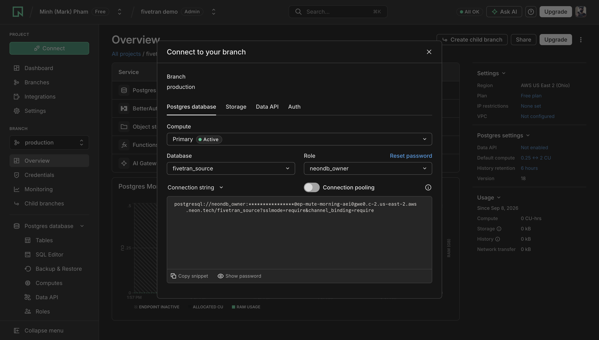

From a URI like `postgresql://neondb_owner:…@HOST/fivetran_source?sslmode=require`:

- **Host** = `HOST` (no `https://`, no database path)
- **User** / **Password** = the role and secret from Connect (next step)
- **Database** = `fivetran_source` (the path after the host, not `neondb`)

Logical replication is incompatible with Neon’s pooled (`-pooler`) endpoint.

### Database access

| Field | Value |
|---|---|
| Database | `fivetran_source` (**do not leave this blank**; the form starts empty) |
| Authentication method | Username and password |
| User | `neondb_owner` (or whichever role owns `l1_landing`) |
| Password | Neon Connect → Show password |

**Data processing location** should be near Neon. This demo’s Neon project is AWS `us-east-2` (Ohio). If Fivetran has no `us-east-2` processing region, the closest US / AWS region is fine.


### Incremental sync

| Field | Value |
|---|---|
| Update method | **Logical replication of the WAL using the pgoutput plugin** |
| Replication slot | `replication_slot_01` |
| Publication name | `publication_01` |

Those names must match [`source/sql/replication.sql`](../source/sql/replication.sql) exactly (`publication_1` will fail).

If Neon uses an IP allow list, add [Fivetran’s IPs](https://fivetran.com/docs/connectors/databases/postgresql/setup-guide) before you test.

## 2. Save and test (Neon)

You want green checks on the certificate, connecting, setup, and **Testing logical replication**.

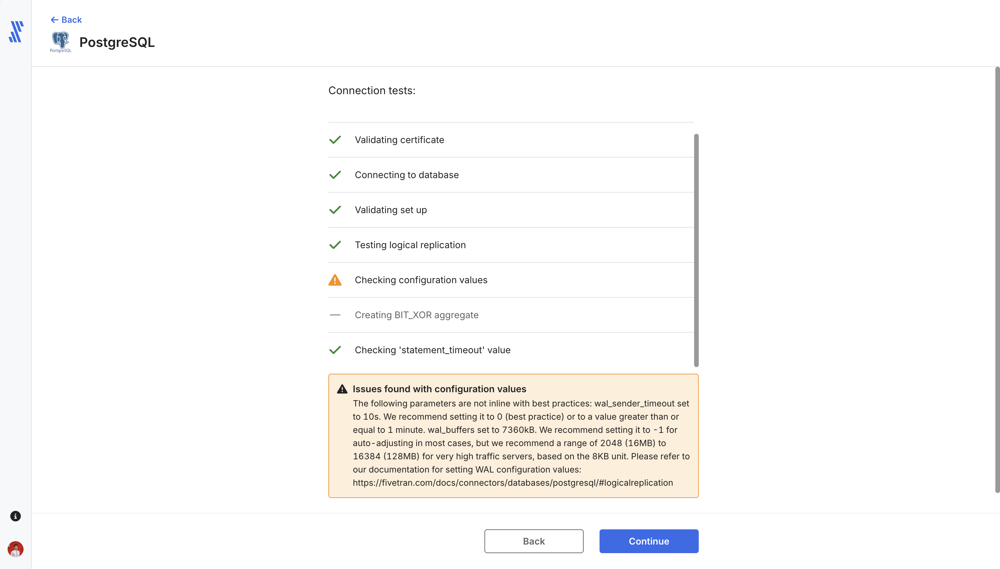

**Checking configuration values** often warns on Neon Free:

| Setting | Typical Neon value | Fivetran recommendation |
|---|---|---|
| `wal_sender_timeout` | `10s` | `0`, or at least 1 minute |
| `wal_buffers` | a few MB | `-1` (auto) |

You cannot change those on Neon the way you would on self-hosted Postgres. **Continue** is fine for this demo. `Creating BIT_XOR aggregate` may show a dash; ignore it.

If **Testing logical replication** fails: `SHOW wal_level;` must be `logical`, and `publication_01` / `replication_slot_01` must exist on `fivetran_source` (not `neondb`). If **Connecting to database** fails, the usual misses are a `-pooler` host, blank Database, or the wrong password.

## 3. Snowflake destination (Fivetran → Snowflake)

In Fivetran: **Destinations → Add destination → Snowflake**. This is a destination, not a source connector. Point the Postgres connection at this destination before the initial sync.

Copy the private key (full PEM, including `BEGIN` / `END`):

```bash
pbcopy < ~/.snowflake/fivetran_rsa_key.p8
```

Fill the form:

| Fivetran field | Value |
|---|---|
| Host | `<org>-<account>.snowflakecomputing.com` (hyphen, not a dot). From Snowsight account details or `CURRENT_ORGANIZATION_NAME()` + `CURRENT_ACCOUNT_NAME()` in [`verify.sql`](../snowflake/sql/verify.sql). |
| Port | `443` |
| User | `FIVETRAN_USER` |
| Database | `FIVETRAN_DEMO` |
| Auth | **Key pair** (`KEY_PAIR`) |
| Private key | Full contents of `~/.snowflake/fivetran_rsa_key.p8` |
| Is private key encrypted? | **Off** (the setup used `-nocrypt`) |
| Role | `FIVETRAN_ROLE` (optional in the UI; fill it anyway so Fivetran does not rely on the user’s default) |
| Warehouse | `FIVETRAN_WAREHOUSE` |

Do not paste the public `.pub` file here. Snowflake already has the public half; Fivetran needs the private half.

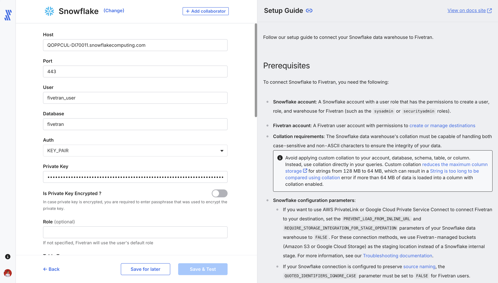

The screenshot shows the form layout. Your host will differ. **Database** must be `FIVETRAN_DEMO` (the object [`fivetran_setup.sql`](../snowflake/sql/fivetran_setup.sql) created), not a shortened name.

**Save & Test.** You want **All connection tests passed!**:

| Test | Expect |
|---|---|
| Host Connection | Pass |
| Validate Passphrase | Dash (skipped; key is not encrypted) |
| Default Warehouse Test | Pass (`FIVETRAN_WAREHOUSE`) |
| Database Connection | Pass (`FIVETRAN_DEMO`) |
| Validate Internal Stage Access | Pass |
| Permission Test | Pass (`FIVETRAN_ROLE` grants) |

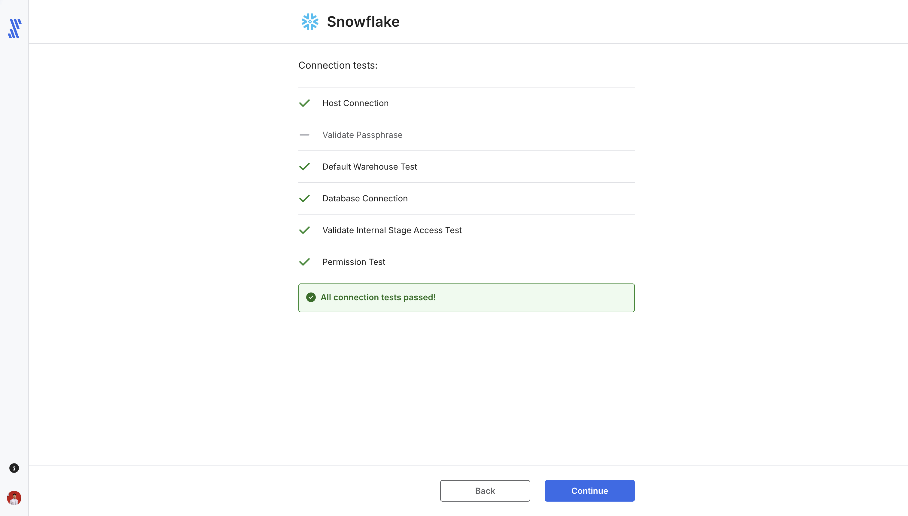

If Host Connection fails, the hostname is usually wrong (dot instead of hyphen, or the old locator form). If Permission Test fails, re-run [`fivetran_setup.sql`](../snowflake/sql/fivetran_setup.sql) and [`verify.sql`](../snowflake/sql/verify.sql). If the private key is rejected, confirm you pasted the `.p8` (not `.pub`) and that `fivetran_keypair.sql` ran against the matching public key.

## 4. Initial sync

After both connections test clean, the Postgres connection lands on **Status** with **Start initial sync** still open. The connection is **Paused** until you choose tables.

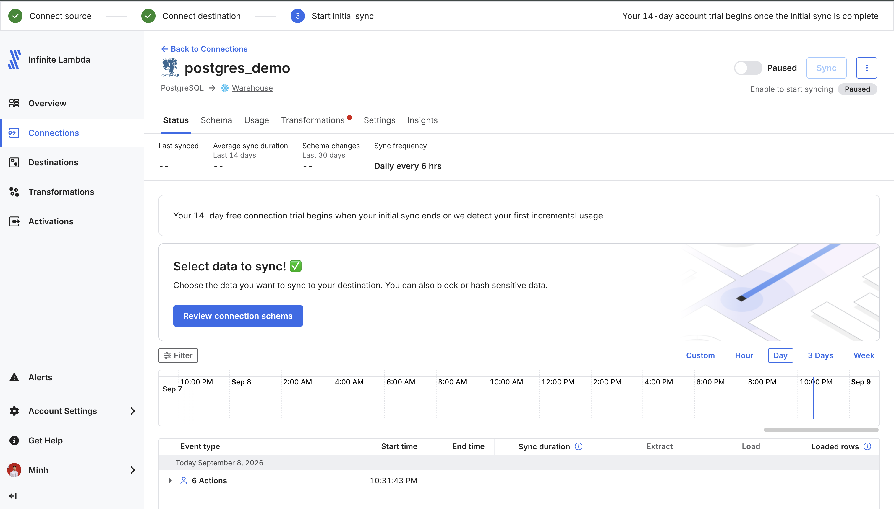

1. Click **Review connection schema**.
2. Select schema `l1_landing` (or the eight OMS tables). Leave Fivetran system tables alone.
3. Save, then start the sync (unpause / Sync).

A successful historical sync for this dataset is on the order of **half a minute** and **2,747 rows** extracted and loaded:

| Table | Rows |
|---|---|
| `customers` | 100 |
| `dates` | 365 |
| `employees` | 101 |
| `products` | 200 |
| `suppliers` | 20 |
| `stores` | 10 |
| `orderitems` | 1,651 |
| `orders` | 300 |

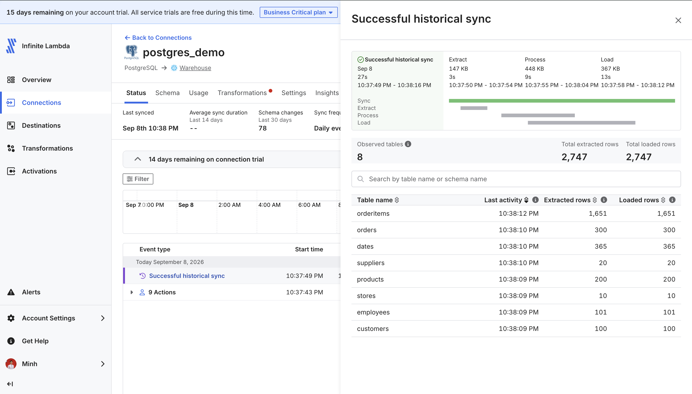

In Snowsight, confirm the replica (schema name is uppercase in Snowflake):

```sql
SHOW SCHEMAS IN DATABASE FIVETRAN_DEMO;

SELECT COUNT(*) FROM FIVETRAN_DEMO.POSTGRES_DEMO_L1_LANDING.CUSTOMERS;
```

Expect `100`. `SHOW SCHEMAS` is the important one: whatever name it reports is the name `vars.fivetran_schema` in [`dbt_project.yml`](../dbt_project.yml) must hold. Fix it and push before you connect the project in section 5, or every model fails with `Schema 'FIVETRAN_DEMO.L1_LANDING' does not exist or not authorized`.

You will also see a `FIVETRAN_*_STAGING` schema. That is Fivetran's internal staging area; ignore it.

## 5. Transformations: connect this dbt repo to Fivetran

Fivetran does not only load the data; it also runs the dbt project. **Transformations for dbt Core** clones this Git repository over SSH and runs your models in Snowflake on a schedule. You do not run `dbt` on your laptop for the scheduled builds, and there is no dbt Cloud account.

Official guides: [Transformations for dbt Core setup](https://fivetran.com/docs/transformations/dbt/setup-guide), [`deployment.yml`](https://fivetran.com/docs/transformations/dbt/setup-guide/deployment-yaml-file).

Before you start:

- The initial sync in section 4 finished, so the landing schema (`FIVETRAN_DEMO.POSTGRES_DEMO_L1_LANDING`) exists and `vars.fivetran_schema` matches it.
- [`snowflake/sql/dbt_setup.sql`](../snowflake/sql/dbt_setup.sql) has run, so `TRANSFORM` and `SERVE` exist and `FIVETRAN_ROLE` can write into them.
- This repo is pushed to GitHub and you can add a **deploy key** to it (repository admin).

### 5.1 Start the dbt Core project

**Transformations → Add transformation → select your Snowflake destination.** On **Select project type**, hover **dbt Core** and click **Connect project**.

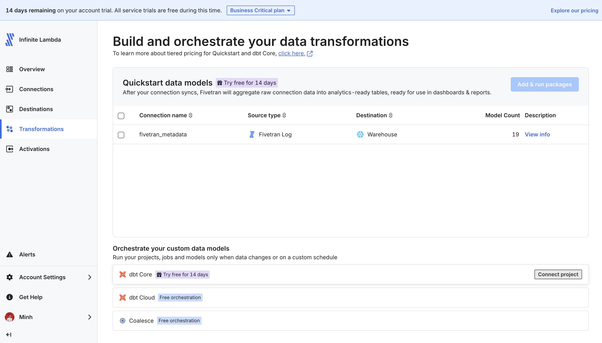

The Quickstart data models block above it is a different feature (prebuilt packages). Ignore it. dbt Core is under **Orchestrate your custom data models**.

### 5.2 Give Fivetran read access to the repo

Fivetran generates an SSH key pair for Git access and shows you the **public** half. This is separate from the Snowflake `.p8` key pairs; nothing is reused between them.

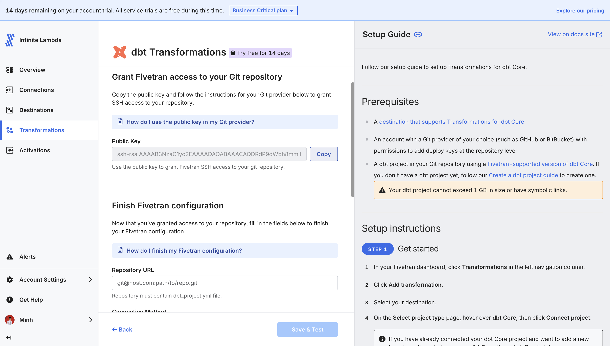

1. Click **Copy** next to **Public Key**.
2. In GitHub: **repository → Settings → Deploy keys → Add deploy key**. Title `fivetran`, paste the key, leave **Allow write access** unchecked. Fivetran only needs to clone.

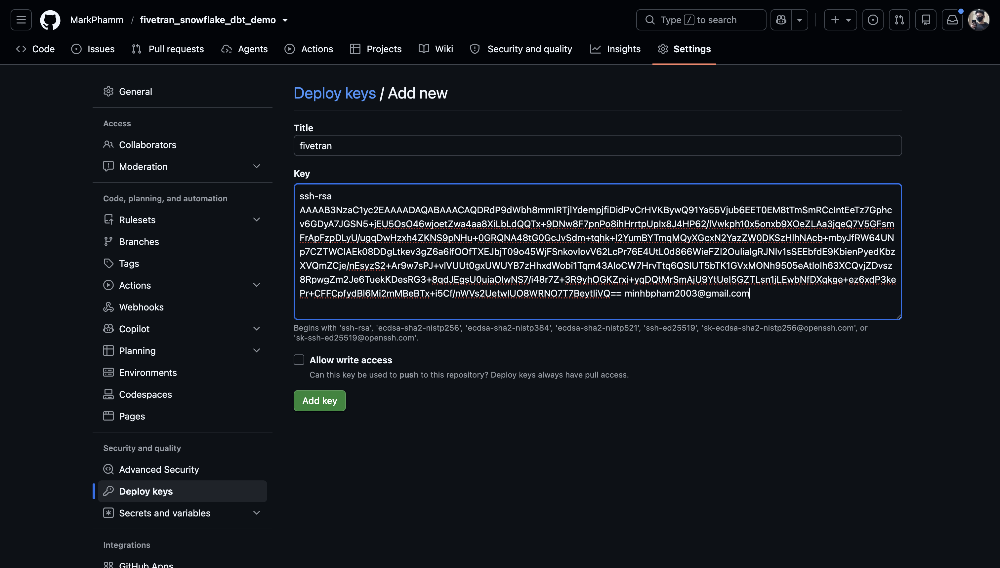

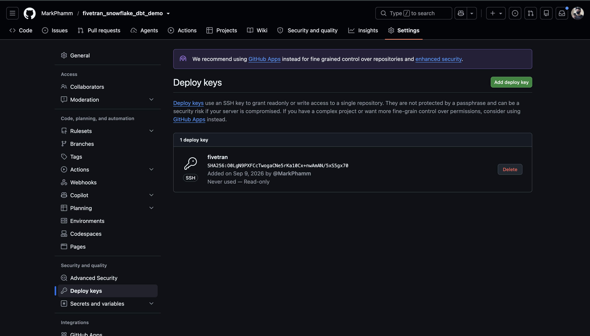

### 5.3 Finish the Fivetran configuration

Back in Fivetran, fill **Finish Fivetran configuration**:

| Field | Value |
|---|---|
| Repository URL | The **SSH** URL, `git@github.com:YOUR_USER/fivetran_snowflake_dbt_demo.git`. Not the HTTPS URL. |
| Connection Method | **Directly** |
| Default Schema Name | `TRANSFORM` |
| dbt Core Version | Leave **Automatically use latest patch version** on and pick the newest minor version Fivetran offers. This project has no version-sensitive syntax. Check what you build against locally with `dbt --version`. |
| Automatically run `dbt deps` | Leave on. This project has no `packages.yml`, so it is a no-op. |
| Git branch (Advanced) | `main`, the default |
| Project path (Advanced) | Leave empty. [`dbt_project.yml`](../dbt_project.yml) is at the repo root. |

**Save & Test**, then **Done**. Fivetran syncs the project in a couple of minutes.

Two things are worth knowing:

- Fivetran writes its own `profiles.yml` from the **destination** credentials. Your local `profiles.yml` is gitignored and is never used by Fivetran. That also means the scheduled models are built by `FIVETRAN_USER` / `FIVETRAN_ROLE` on `FIVETRAN_WAREHOUSE`, not by `DBT_USER`.
- `Default Schema Name` only applies to models with no `+schema`. This project overrides [`macros/generate_schema_name.sql`](../macros/generate_schema_name.sql) so `+schema: TRANSFORM` and `+schema: SERVE` in [`dbt_project.yml`](../dbt_project.yml) are used verbatim, with no prefix.

### 5.4 Edit `deployment.yml`

Jobs come from [`deployment.yml`](../deployment.yml) in the repo root. Fivetran parses it on every project sync and creates or updates the jobs it finds. You must change one value before it works:

```yaml
jobs:
  - name: Daily-after-landing
    schedule:
      type: integrated
      integrations:
        - verdure_rephrase # replace with your postgres connection id
```

Replace `verdure_rephrase` with **your** Postgres connection ID, which is the two-word system name Fivetran assigned the connection, not the display name `postgres_demo`. Find it in **Connections → your Postgres connection → Setup**, or read it out of the browser URL. With `type: integrated`, the daily models run as soon as that connection finishes a sync.

The second job uses `type: cron` and needs no edit. Commit and push the change; the jobs appear under **Transformations** after the next project sync.

| Job | Trigger | Command |
|---|---|---|
| `Daily-after-landing` | Integrated, after the Postgres connection syncs | `dbt run --select +tag:daily` |
| `Weekly-3am` | Cron `0 3 * * 0` (Sundays) | `dbt run --select +tag:weekly` |

`+tag:daily` means `customerrevenue` **and everything it depends on**, so the staging models and `orders_fact` are rebuilt in the same run.

### 5.5 Transformation checkpoint

Run a job manually from the Transformations tab instead of waiting for the schedule. Both jobs should end on **Succeeded**.

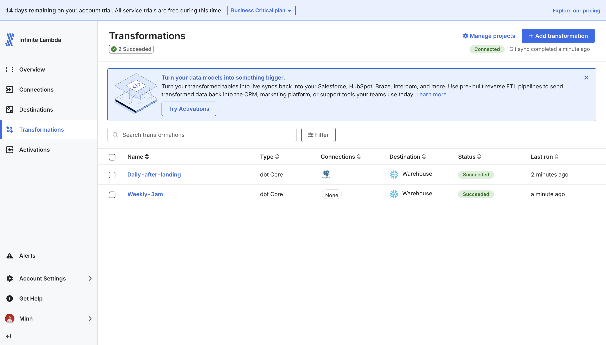

The **Connections** column is the quickest check that section 5.4 worked. `Daily-after-landing` shows `postgres_demo` because its integrated schedule resolved the connection ID. If it says **None**, the ID in `deployment.yml` is wrong and the job will never fire on its own. `Weekly-3am` showing **None** is correct: it runs on cron and is not tied to a connection.

Open a job and read the **Run log** to see the dbt output Fivetran captured:

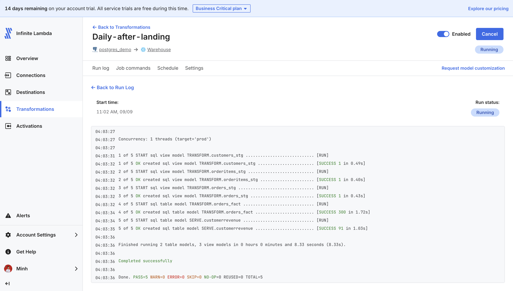

Two details worth noticing. The header says `target='prod'` — that is Fivetran's generated profile, not the `dev` target from your local `profiles.yml`. And the run builds **five** models, not seven: `+tag:daily` pulls in `customerrevenue` plus the three staging models and `orders_fact` it depends on, while `employees_stg` and `emp_weekly_sales` belong to the weekly job.

Confirm the result in Snowsight:

```sql
SELECT COUNT(*) FROM FIVETRAN_DEMO.SERVE.CUSTOMERREVENUE;
```

If a job fails on `Object does not exist or not authorized`, check which object the message names. If it is `TRANSFORM` or `SERVE`, `FIVETRAN_ROLE` is missing the write grants: re-run [`snowflake/sql/dbt_setup.sql`](../snowflake/sql/dbt_setup.sql). If it is the landing schema, `vars.fivetran_schema` does not match the name Fivetran actually created (section 4) — that is a naming mismatch, not a permission problem.

## Screenshots in `assets/fivetran`

Ingestion (`assets/fivetran/ingestion`):

| Asset | What it shows |
|---|---|
| [`postgres_connection_auth.png`](../assets/fivetran/ingestion/postgres_connection_auth.png) | Database access: user `neondb_owner`. Type **Database** `fivetran_source` (the field starts empty). |
| [`postgres_connection_success.png`](../assets/fivetran/ingestion/postgres_connection_success.png) | Source tests passed, including logical replication. WAL warnings are expected on Neon. |
| [`snowflake_destination_auth.png`](../assets/fivetran/ingestion/snowflake_destination_auth.png) | Snowflake destination form: port `443`, key-pair, private key pasted. Fill Database `FIVETRAN_DEMO` and Role `FIVETRAN_ROLE`. |
| [`snowflake_destination_success.png`](../assets/fivetran/ingestion/snowflake_destination_success.png) | Destination tests passed (host, warehouse, database, stage, permissions). |
| [`initial_sync.png`](../assets/fivetran/ingestion/initial_sync.png) | Connection `postgres_demo` after tests: paused, waiting on **Review connection schema**. |
| [`initial_sync_success.png`](../assets/fivetran/ingestion/initial_sync_success.png) | Historical sync done: eight OMS tables, 2,747 rows. |

Transformation (`assets/fivetran/transformation`):

| Asset | What it shows |
|---|---|
| [`connect_dbt_core.png`](../assets/fivetran/transformation/connect_dbt_core.png) | Transformations page. **dbt Core → Connect project** under *Orchestrate your custom data models*. |
| [`dbt_core_public_key.png`](../assets/fivetran/transformation/dbt_core_public_key.png) | Fivetran's generated public key and the Repository URL field. |
| [`add_pub_key_to_github.png`](../assets/fivetran/transformation/add_pub_key_to_github.png) | GitHub **Settings → Deploy keys → Add new**, write access off. |
| [`add_pub_key_success.png`](../assets/fivetran/transformation/add_pub_key_success.png) | The `fivetran` deploy key registered, read-only. |
| [`transformation_success.png`](../assets/fivetran/transformation/transformation_success.png) | Both jobs **Succeeded**. `Daily-after-landing` shows its `postgres_demo` connection; the cron job shows none. |
| [`transformation_success_logs.png`](../assets/fivetran/transformation/transformation_success_logs.png) | Run log for `Daily-after-landing`: five models on `target='prod'`, `PASS=5`. |

Neon Connect (host, pooling off) lives in [`assets/source/connection.png`](../assets/source/connection.png). Snowflake object setup lives in [`assets/snowflake`](../assets/snowflake).

## Next step

Optional: install dbt Core locally to develop and test models before you push. See [Part 2 of the project README](../README.md#part-2--dbt-transformations-run-by-fivetran).
