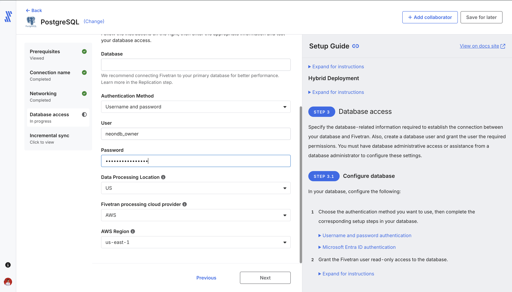

# Fivetran: Neon Postgres to Snowflake

Fivetran extracts from Neon (`fivetran_source`) and loads into Snowflake (`FIVETRAN_DEMO`). Do this after the [source](../source/README.md) and [Snowflake](../snowflake/README.md) objects exist.

Official guides: [Postgres connector](https://fivetran.com/docs/connectors/databases/postgresql/setup-guide), [Snowflake destination](https://fivetran.com/docs/destinations/snowflake/setup-guide), [Neon + Fivetran](https://neon.com/docs/guides/logical-replication-fivetran).

Create the **PostgreSQL** source first, then the **Snowflake** destination. Attach the destination before you start the initial sync.

## Before you open Fivetran

1. Neon: `l1_landing` loaded, logical replication enabled, [`source/sql/replication.sql`](../source/sql/replication.sql) run (`publication_01`, `replication_slot_01`).
2. Snowflake: [`fivetran_setup.sql`](../snowflake/sql/fivetran_setup.sql) and [`fivetran_keypair.sql`](../snowflake/sql/fivetran_keypair.sql) run. Keep `~/.snowflake/fivetran_rsa_key.p8` on this machine.
3. A [Fivetran free account](https://fivetran.com/signup).

Have two browser tabs ready: Neon **Connect** (pooling off) and Snowsight **View account details** (or the host from [`verify.sql`](../snowflake/sql/verify.sql)).

## 1. Postgres source (Neon → Fivetran)

**Connections → Add connection → PostgreSQL.**

The wizard is: Prerequisites → Connection name → Networking → Database access → Incremental sync.

### Connection name

Pick a name (this demo uses `postgres_demo`). The destination schema prefix is tied to this connection and **cannot change later**. Prefer Fivetran’s **source naming** so Snowflake gets `L1_LANDING` (what dbt expects). A prefix produces something like `POSTGRES_DEMO_L1_LANDING`; then you must override `fivetran_schema` in dbt.

If the wizard asks which destination to write to, add Snowflake in [section 3](#3-snowflake-destination-fivetran--snowflake) (or create it when prompted) before you start the sync.

### Networking

Copy values from Neon **Connect**. Database `fivetran_source`, role `neondb_owner`, **Connection pooling off**.

| Fivetran field | Value |
|---|---|
| Connection method | **Connect directly** |
| Host | The hostname after `@` in the Neon URI. It must **not** contain `-pooler`. Example shape: `ep-….us-east-2.aws.neon.tech` |
| Port | `5432` |
| SSL | Required (`sslmode=require` in the Neon URI) |


From a URI like `postgresql://neondb_owner:…@HOST/fivetran_source?sslmode=require`:

- **Host** = `HOST` (no `https://`, no database path)
- **User** / **Password** = the role and secret from Connect (next step)
- **Database** = `fivetran_source` (the path after the host, not `neondb`)

Logical replication is incompatible with Neon’s pooled (`-pooler`) endpoint.

### Database access

| Field | Value |
|---|---|
| Database | `fivetran_source` (**do not leave this blank**; the form starts empty) |
| Authentication method | Username and password |
| User | `neondb_owner` (or whichever role owns `l1_landing`) |
| Password | Neon Connect → Show password |

**Data processing location** should be near Neon. This demo’s Neon project is AWS `us-east-2` (Ohio). If Fivetran has no `us-east-2` processing region, the closest US / AWS region is fine.



### Incremental sync

| Field | Value |
|---|---|
| Update method | **Logical replication of the WAL using the pgoutput plugin** |
| Replication slot | `replication_slot_01` |
| Publication name | `publication_01` |

Those names must match [`source/sql/replication.sql`](../source/sql/replication.sql) exactly (`publication_1` will fail).

If Neon uses an IP allow list, add [Fivetran’s IPs](https://fivetran.com/docs/connectors/databases/postgresql/setup-guide) before you test.

## 2. Save and test (Neon)

You want green checks on the certificate, connecting, setup, and **Testing logical replication**.


**Checking configuration values** often warns on Neon Free:

| Setting | Typical Neon value | Fivetran recommendation |
|---|---|---|
| `wal_sender_timeout` | `10s` | `0`, or at least 1 minute |
| `wal_buffers` | a few MB | `-1` (auto) |

You cannot change those on Neon the way you would on self-hosted Postgres. **Continue** is fine for this demo. `Creating BIT_XOR aggregate` may show a dash; ignore it.

If **Testing logical replication** fails: `SHOW wal_level;` must be `logical`, and `publication_01` / `replication_slot_01` must exist on `fivetran_source` (not `neondb`). If **Connecting to database** fails, the usual misses are a `-pooler` host, blank Database, or the wrong password.

## 3. Snowflake destination (Fivetran → Snowflake)

In Fivetran: **Destinations → Add destination → Snowflake**. This is a destination, not a source connector. Point the Postgres connection at this destination before the initial sync.

Copy the private key (full PEM, including `BEGIN` / `END`):

```bash
pbcopy < ~/.snowflake/fivetran_rsa_key.p8
```

Fill the form:

| Fivetran field | Value |
|---|---|
| Host | `<org>-<account>.snowflakecomputing.com` (hyphen, not a dot). From Snowsight account details or `CURRENT_ORGANIZATION_NAME()` + `CURRENT_ACCOUNT_NAME()` in [`verify.sql`](../snowflake/sql/verify.sql). |
| Port | `443` |
| User | `FIVETRAN_USER` |
| Database | `FIVETRAN_DEMO` |
| Auth | **Key pair** (`KEY_PAIR`) |
| Private key | Full contents of `~/.snowflake/fivetran_rsa_key.p8` |
| Is private key encrypted? | **Off** (the setup used `-nocrypt`) |
| Role | `FIVETRAN_ROLE` (optional in the UI; fill it anyway so Fivetran does not rely on the user’s default) |
| Warehouse | `FIVETRAN_WAREHOUSE` |

Do not paste the public `.pub` file here. Snowflake already has the public half; Fivetran needs the private half.


The screenshot shows the form layout. Your host will differ. **Database** must be `FIVETRAN_DEMO` (the object [`fivetran_setup.sql`](../snowflake/sql/fivetran_setup.sql) created), not a shortened name.

**Save & Test.** You want **All connection tests passed!**:

| Test | Expect |
|---|---|
| Host Connection | Pass |
| Validate Passphrase | Dash (skipped; key is not encrypted) |
| Default Warehouse Test | Pass (`FIVETRAN_WAREHOUSE`) |
| Database Connection | Pass (`FIVETRAN_DEMO`) |
| Validate Internal Stage Access | Pass |
| Permission Test | Pass (`FIVETRAN_ROLE` grants) |


If Host Connection fails, the hostname is usually wrong (dot instead of hyphen, or the old locator form). If Permission Test fails, re-run [`fivetran_setup.sql`](../snowflake/sql/fivetran_setup.sql) and [`verify.sql`](../snowflake/sql/verify.sql). If the private key is rejected, confirm you pasted the `.p8` (not `.pub`) and that `fivetran_keypair.sql` ran against the matching public key.

## 4. Initial sync

After both connections test clean, the Postgres connection lands on **Status** with **Start initial sync** still open. The connection is **Paused** until you choose tables.


1. Click **Review connection schema**.
2. Select schema `l1_landing` (or the eight OMS tables). Leave Fivetran system tables alone.
3. Save, then start the sync (unpause / Sync).

A successful historical sync for this dataset is on the order of **half a minute** and **2,747 rows** extracted and loaded:

| Table | Rows |
|---|---|
| `customers` | 100 |
| `dates` | 365 |
| `employees` | 101 |
| `products` | 200 |
| `suppliers` | 20 |
| `stores` | 10 |
| `orderitems` | 1,651 |
| `orders` | 300 |


In Snowsight, confirm the replica (schema name is uppercase in Snowflake):

```sql
SHOW SCHEMAS IN DATABASE FIVETRAN_DEMO;

SELECT COUNT(*) FROM FIVETRAN_DEMO.L1_LANDING.CUSTOMERS;
```

Expect `100`. If the schema is prefixed (for example `POSTGRES_DEMO_L1_LANDING`), use that name in the `SELECT` and set `vars.fivetran_schema` in [`dbt_project.yml`](../dbt_project.yml) before `dbt run`.

## Screenshots in `assets/fivetran`

| Asset | What it shows |
|---|---|
| [`postgres_connection_auth.png`](../assets/fivetran/postgres_connection_auth.png) | Database access: user `neondb_owner`. Type **Database** `fivetran_source` (the field starts empty). |
| [`postgres_connection_success.png`](../assets/fivetran/postgres_connection_success.png) | Source tests passed, including logical replication. WAL warnings are expected on Neon. |
| [`snowflake_destination_auth.png`](../assets/fivetran/snowflake_destination_auth.png) | Snowflake destination form: port `443`, key-pair, private key pasted. Fill Database `FIVETRAN_DEMO` and Role `FIVETRAN_ROLE`. |
| [`snowflake_destination_success.png`](../assets/fivetran/snowflake_destination_success.png) | Destination tests passed (host, warehouse, database, stage, permissions). |
| [`initial_sync.png`](../assets/fivetran/initial_sync.png) | Connection `postgres_demo` after tests: paused, waiting on **Review connection schema**. |
| [`initial_sync_success.png`](../assets/fivetran/initial_sync_success.png) | Historical sync done: eight OMS tables, 2,747 rows. |

Neon Connect (host, pooling off) lives in [`assets/source/connection.png`](../assets/source/connection.png). Snowflake object setup lives in [`assets/snowflake`](../assets/snowflake).

## Next step

Run [`snowflake/sql/dbt_setup.sql`](../snowflake/sql/dbt_setup.sql), attach the dbt key, then `uv sync` and `dbt debug` / `dbt run` from the [project README](../README.md).
