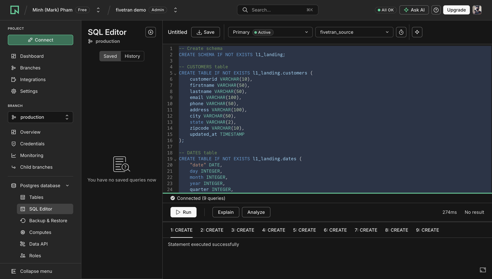
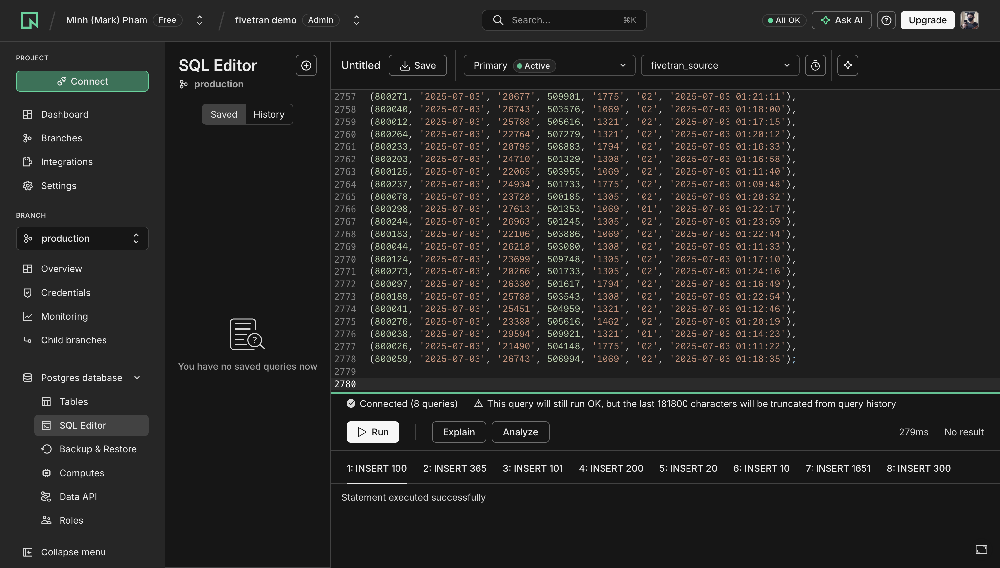
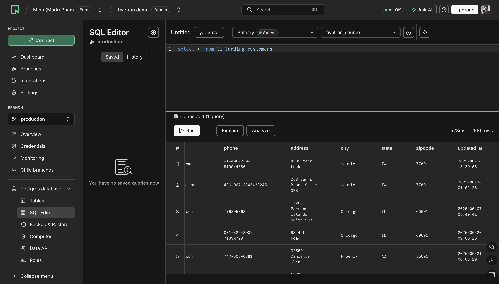

# Neon source setup

This folder is the **operational source** for the demo: a Postgres database hosted on [Neon](https://neon.tech) that Fivetran will replicate into Snowflake.

Sample data comes from the [SleekMart OMS](https://github.com/sleekdata/oms-db-setup) educational dataset (SleekData). Use it for personal and educational purposes only.

## What is Neon?

[Neon](https://neon.com/docs/get-started/why-neon) is a serverless Postgres platform. It is standard PostgreSQL (drivers, SQL, extensions, and tools you already know), hosted as a managed service.

Neon separates **storage** from **compute**. That architecture is what makes instant branching, autoscaling, and scale-to-zero possible without you managing a Postgres instance.

Neon is now part of Databricks. For this demo we only use it as a hosted Postgres source.

## Why Neon is the Fivetran source

Fivetran needs a real, always-reachable database to extract from. Neon gives us that without running Postgres locally:

- It speaks **standard Postgres**, which Fivetran already supports as a source connector.
- The Free plan is enough for this OMS sample (a few thousand rows).
- The SQL Editor in the Neon Console is enough to create the schema, load data, and confirm rows before you wire Fivetran.
- A connection string from **Connect** is what you later paste into Fivetran.

In this project the Neon database is named `fivetran_source`. All demo tables live in the `l1_landing` schema.

## Key features we rely on

| Feature | Why it matters here |
|---|---|
| Serverless Postgres | No instance to provision. Create a project and start querying. |
| SQL Editor | Run `schema.sql` and `insert.sql` in the browser. |
| Scale to zero | Idle compute suspends after a few minutes, so a demo project stays cheap. |
| Autoscaling | Compute grows with load if you later add more data. |
| Branching | Copy-on-write clones of the database for experiments, without touching the branch Fivetran reads. |
| Connection strings | Host, user, password, and database name for the Fivetran Postgres connector. |
| Free plan | Enough storage and compute hours for this dataset. |

## Create a Neon account

1. Open [https://console.neon.tech/signup](https://console.neon.tech/signup).
2. Sign up with GitHub, Google, email, or another supported identity provider.
3. Verify your email if prompted.
4. You land in the [Neon Console](https://console.neon.tech). The Free plan is enough for this demo.

Official overview: [Why Neon](https://neon.com/docs/get-started/why-neon) and [Tour the Neon Console](https://neon.com/docs/get-started/signing-up).

## Create a project and the `fivetran_source` database

A Neon **project** holds branches, databases, and roles. A **branch** (this demo uses `production`) holds the actual Postgres databases.

1. In the Console, create a project (for example `fivetran demo`).
2. Pick a region close to you. A project starts with a default branch (`production` in the Console) and a default database named `neondb`.
3. Create the database this demo uses:
   - Open your project.
   - Confirm the `production` branch is selected.
   - Under **Postgres Database**, open **Databases**.
   - Click **Add database**.
   - Name it `fivetran_source` and keep the default owner.
   - Click **Create**.

You cannot create this database from `database.sql` inside the `fivetran_source` session itself. Create it in the Console (or while connected to `neondb`), then switch the SQL Editor to `fivetran_source`.

```sql
-- Only if you prefer SQL while connected to neondb:
CREATE DATABASE fivetran_source;
```

## Load the OMS schema and data

SQL files in this folder:

| File | Purpose |
|---|---|
| `database.sql` | Notes on creating `fivetran_source` (Neon already hosts the project). |
| `schema.sql` | Creates `l1_landing` and the eight OMS tables. |
| `insert.sql` | Loads sample customers, dates, employees, products, suppliers, stores, order items, and orders. |

Identifiers are unquoted and lowercase so they match Postgres folding (`l1_landing.customers`, not `"L1_LANDING"."CUSTOMERS"`).

### 1. Create tables

In the Neon Console:

1. Open **Postgres Database > SQL Editor**.
2. Set the database dropdown to **`fivetran_source`**.
3. Paste the contents of `schema.sql`.
4. Click **Run**.

You should see **Statement executed successfully** for each `CREATE` statement.



### 2. Insert sample rows

Still on `fivetran_source` in the SQL Editor:

1. Paste the contents of `insert.sql`.
2. Click **Run**.

The script is large (about 180k characters). The editor may warn that history will be truncated. The inserts still run.

You should see one successful `INSERT` per table. Typical row counts:

| Table | Rows |
|---|---|
| `l1_landing.customers` | 100 |
| `l1_landing.dates` | 365 |
| `l1_landing.employees` | 100 |
| `l1_landing.products` | 200 |
| `l1_landing.suppliers` | 20 |
| `l1_landing.stores` | 10 |
| `l1_landing.orderitems` | 1,651 |
| `l1_landing.orders` | 300 |



### 3. Query to confirm

Run:

```sql
SELECT * FROM l1_landing.customers;
```

You should get **100 rows**. That is the checkpoint that the source is ready for Fivetran.



A few more useful checks:

```sql
SELECT COUNT(*) FROM l1_landing.orders;
SELECT COUNT(*) FROM l1_landing.orderitems;

SELECT o.orderid, o.orderdate, c.firstname, c.lastname, o.status
FROM l1_landing.orders o
JOIN l1_landing.customers c ON c.customerid = o.customerid
ORDER BY o.orderdate DESC
LIMIT 10;
```

You can also browse tables under **Postgres Database > Tables**.

## Screenshots in `assets/source`

These screenshots are the expected Console state after each step:

| Asset | What it shows |
|---|---|
| [`schema_create_success.png`](../assets/source/schema_create_success.png) | SQL Editor on branch `production`, database `fivetran_source`, after `schema.sql` succeeds. |
| [`insert_success.png`](../assets/source/insert_success.png) | Same editor after `insert.sql` loads all eight tables. |
| [`query_success.png`](../assets/source/query_success.png) | `SELECT * FROM l1_landing.customers` returning 100 rows. |

If your editor does not look like these, check the database dropdown. Running SQL against `neondb` instead of `fivetran_source` is the usual miss.

## Connection string for Fivetran

When you are ready to connect Fivetran:

1. In the project sidebar, click **Connect**.
2. Copy the connection string (or host, port, database, user, and password from **Credentials**).
3. Use database name `fivetran_source`.
4. Enable SSL (`sslmode=require`). Neon requires it.
5. Prefer the **pooled** (`-pooler`) host if the connector supports it; otherwise use the direct host.

Do not commit connection strings or passwords to this repo.

## Next step

With `l1_landing` queryable in Neon, continue from the [project README](../README.md) to connect Fivetran and land the same tables in Snowflake.
